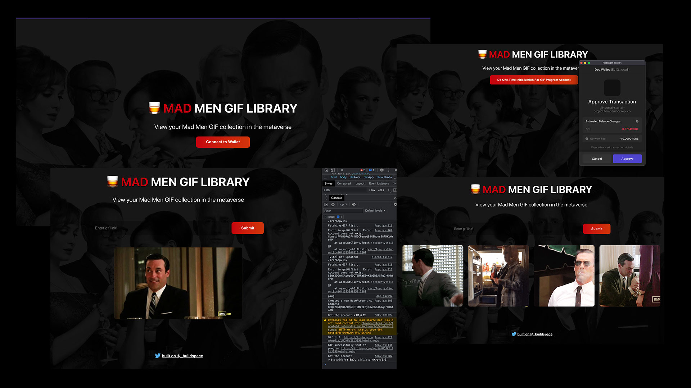
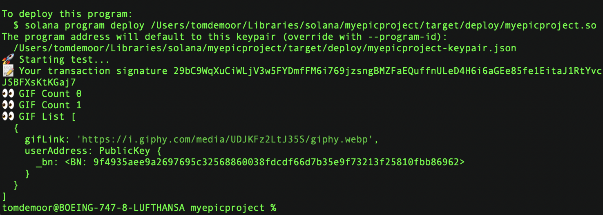
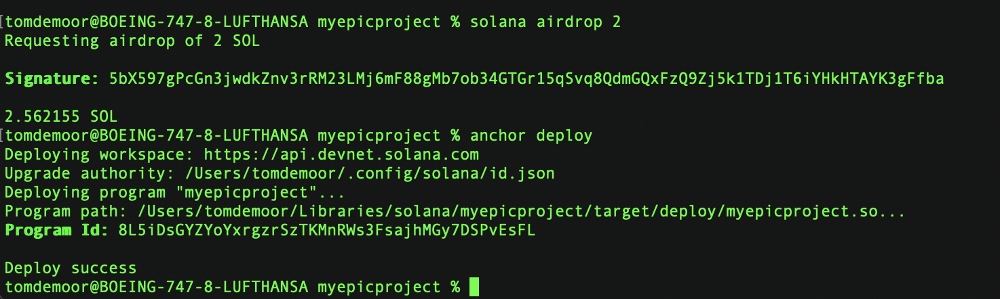
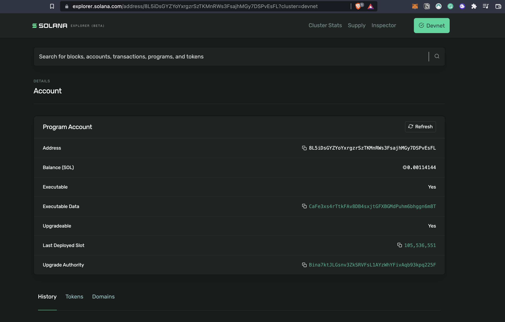

# Web3 App Solana with React & Rust

## About This Project & Workflow
* Get and setup the React webapp: a GIF library for Mad Men with specific features.
* Write the code that will allow users to connect their Solana wallet (Phantom) and connect to your app to setup a basic "auth" state.
* Hopped into writing a first Solana program w/ Rust + deploy to the actual blockchain.
* Optionally update the Solana program with new features.

**Connecting React web app to a Solana wallet.**
* 💻 Building a connect wallet button with Phantom Wallet
* 🌈 Building the GIF grid

**Write a Solana Program**
* 😍 Get local Solana env running
* 🚀 Write my first Solana program
* 🤠 Store basic data on our contract
* 🍿 Store structs on our program

https://github.com/buildspace/buildspace-projects/blob/main/Solana_And_Web3/en/Section_2/Resources/m1_setup.md
M1 chip installation instructions: https://dev.to/nickgarfield/how-to-install-solana-dev-tools-on-an-m1-mac-kfn

**Deploy + connect Solana program to web app**
* 🔌 Deploy program to the devnet.
* 🔎 Call deployed program from web app.
* 🎨 Submitting GIFs to Solana program.

https://explorer.solana.com/address/8L5iDsGYZYoYxrgzrSzTKMnRWs3FsajhMGy7DSPvEsFL?cluster=devnet

**Wrapping Up**
* 🔥 Finishing touches web app & program.

Created with https://app.buildspace.so/. Big recommendation to get into Web3.
NFT for completion: https://opensea.io/tomdemoor

## Running React on Repl.it

[React](https://reactjs.org/) is a popular JavaScript library for building user interfaces.

[Vite](https://vitejs.dev/) is a blazing fast frontend build tool that includes features like Hot Module Reloading (HMR), optimized builds, and TypeScript support out of the box.

Using the two in conjunction is one of the fastest ways to build a web app.

### Getting Started
- Hit run
- Edit [App.jsx](#src/App.jsx) and watch it live update!

By default, Replit runs the `dev` script, but you can configure it by changing the `run` field in the `.replit` file.